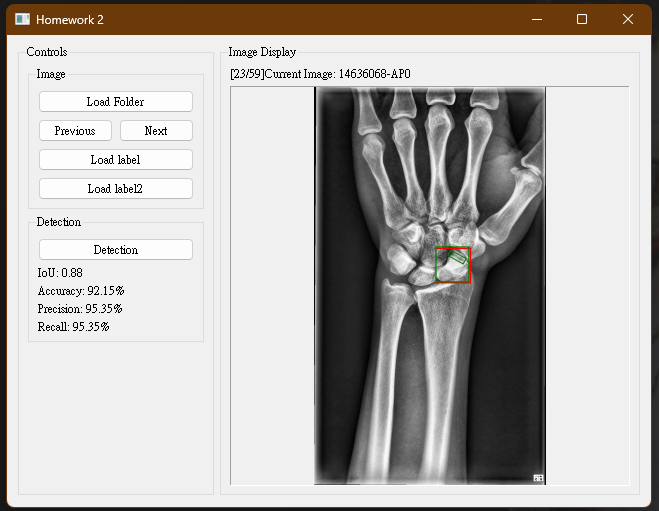
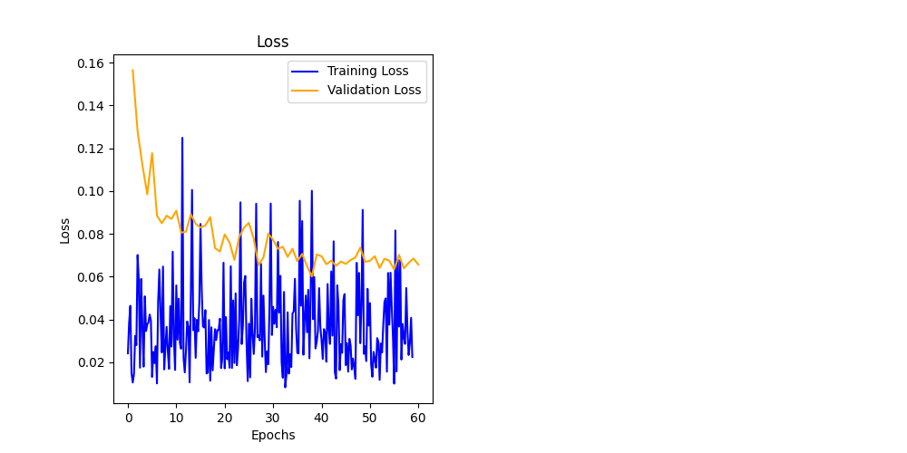

# 腕舟骨骨折偵測（Faster R-CNN）

以 Faster R-CNN 偵測 X 光影像中的腕舟骨與骨折位置，提供簡易 UI 與訓練腳本。
詳細資訊可參照 report 

## 介面預覽



## 快速開始
- 安裝相依套件（自行建立 Python 環境，需含 PyTorch、Gradio 等）。
- 啟動介面：
  ```bash
  python ui.py
  ```

## 訓練（可選）
- 執行：
  ```bash
  python train.py
  ```
- 可於 `config/` 調整參數；資料請放於對應資料夾。



## 注意
- `scaphoid_detection/`（資料）未納入版本控制。
